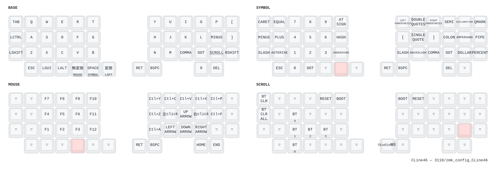

# zmk_config_CLine46

分割キーボード **CLine46** 用の ZMK ファームウェア設定(個人用)。

[takamaru-fpv/zmk_config_CLine46](https://github.com/takamaru-fpv/zmk_config_CLine46) からの fork です。

## 構成

| 項目 | 内容 |
|---|---|
| キー数 | 46(左右23キーずつ) |
| コントローラ | Seeed XIAO BLE (nRF52840) ×2 |
| キースキャン | Charlieplex 方式(D2〜D7、割り込み D1) |
| ポインティング | PMW3610 トラックボール(右手側、SPI0 / CS=P0.09 / IRQ=D8) |
| 電池 | NiMH 単セル(1.02〜1.36V) |
| Central | **右手**(トラックボール側) |
| ZMK Studio | 対応(DYA Studio 拡張込み)。**マクロとコンボも編集可** |
| ベース | [cormoran/zmk](https://github.com/cormoran/zmk) `main+dya` @ `e5c9b69`(Zephyr 4.1) |

## キーマップ



> 画像は Actions の **Draw Keymap** ワークフローで自動生成されます。

### レイヤー

| # | 名前 | 呼び出し方 | 内容 |
|---|---|---|---|
| 0 | BASE | — | 通常のキー入力 |
| 1 | SYMBOL | 右親指 SPACE をホールド | 数字・記号 |
| 2 | MOUSE | 左親指 無変換 をホールド | F1〜F12、マウスクリック、矢印、Ctrl系ショートカット |
| 3 | SCROLL | 右手 `,`/`.` の隣(位置34)を押しっぱなし | **トラックボールがスクロールに変化**。BT プロファイル切替、リセット、Studio 解除 |
| 4-6 | (予約) | — | `status = "reserved"`。ZMK Studio からのみ利用可能 |

### 主要バインド

| キー | 動作 |
|---|---|
| 左親指 無変換 | タップ=無変換 / ホールド=MOUSE レイヤー |
| 右親指 SPACE | タップ=SPACE / ホールド=SYMBOL レイヤー |
| 右親指 変換 | タップ=変換 / ホールド=左Shift |
| SCROLL + 位置42(RET) | `&studio_unlock`(ZMK Studio のロック解除) |
| SCROLL + 位置5 / 6 | `&bootloader`(**押した側の半分**がブートローダーに入る) |
| SCROLL + 位置4 / 7 | `&sys_reset` |

`&mt` と `&lt` はどちらも `flavor = "balanced"` に設定済み。既定の `tap-preferred` だと 200ms 待たないとレイヤーが有効にならず、MOUSE レイヤーのクリックが機能しないため。

### コンボ

| スロット | キー | 出力 | 位置 |
|---|---|---|---|
| 0 | Q + W | Tab | `<1 2>` |
| 1 | W + E | Shift + Tab | `<2 3>` |

いずれも `require-prior-idle-ms = <125>` 付き(タイピング中の誤爆防止)。

コンボは ZMK 標準の `zmk,combos` ではなく
[zmk-feature-runtime-combo](https://github.com/cormoran/zmk-feature-runtime-combo)
の `cormoran,runtime-combo-defaults` で定義しています。`zmk,combos` は
コンパイル時に固定されて DYA Studio から編集できないためです。

`.keymap` に書いた値は**工場出荷値**の扱いで、DYA Studio で上書きするとそちらが
優先され、**Reset to Default** で元に戻せます。追加のコンボは Studio 側から
空きスロットに作れます(上限は `CONFIG_ZMK_RUNTIME_COMBO_MAX_COMBOS`、既定 8)。

### マクロ

マクロは
[zmk-feature-runtime-macro](https://github.com/cormoran/zmk-feature-runtime-macro)
で実現していて、**すべて DYA Studio 上で作成・編集**します(`.keymap` には
`&rmacro` の定義を include してあるだけで、マクロの中身は書きません)。

1. DYA Studio の **Macro&Combo** タブで名前を付けて作成し、手順を編集する
2. 作成すると**スロット番号**が割り当てられるので、リストで番号を確認する
3. キーマップエディタで対象キーに **Runtime Macro** を選び、その番号を指定する

スロット番号は作成時に決まるもので、事前に選ぶものではありません。既定では
最大8個(`CONFIG_ZMK_RUNTIME_MACRO_COUNT`)、名前と本文の合計で 1024 バイト
(`CONFIG_ZMK_RUNTIME_MACRO_POOL_BYTES`)まで保持できます。

### キーポジション番号

コンボの `key-positions` で使う番号。キーマップの `bindings` の記述順と一致します。

```
 0  1  2  3  4  5   |   6  7  8  9 10 11
12 13 14 15 16 17   |  18 19 20 21 22 23
24 25 26 27 28 29   |  30 31 32 33 34 35
   36 37 38 39 40 41 | 42 43     44 45
```

## ビルド

### GitHub Actions(通常はこちら)

1. `config/CLine46.keymap` などを編集して push
2. **Actions** タブでビルド完了を待つ
3. Artifacts から `firmware.zip` をダウンロード

生成される uf2:

| ファイル | 用途 |
|---|---|
| `CLine46_R.uf2` | 右手(Central、ZMK Studio 有効) |
| `CLine46_L.uf2` | 左手(Peripheral) |
| `settings_reset.uf2` | 設定領域の初期化用 |

> ファイル名は `build.yaml` の `artifact-name` で固定しています。指定が無いと
> `CLine46_R rgbled_adapter-xiao_ble_zmk-zmk.uf2` のようにボード名込みの
> 長い名前になり、ZMK のバージョンが上がるたびに変わります。

### ローカルビルド

このリポジトリはルートに `zephyr/module.yml` を持つため、**リポジトリ内で `west init` するとディレクトリが衝突します**。config だけを別ワークスペースにコピーしてビルドします。

```bash
git clone https://github.com/3110/zmk_config_CLine46.git
cd zmk_config_CLine46
mkdir -p ~/zmk-workspace

docker run --rm -it \
  -v "$PWD":/zmk-config \
  -v ~/zmk-workspace:/workspace \
  -w /workspace \
  zmkfirmware/zmk-build-arm:stable bash
```

コンテナ内:

```bash
# 初回のみ
mkdir -p config && cp -R /zmk-config/config/* config/
west init -l config
west update
west zephyr-export

# 右手(Central・Studio あり)
west build -s zmk/app -d build/right -b xiao_ble//zmk -S studio-rpc-usb-uart -- \
  -DSHIELD="CLine46_R rgbled_adapter" \
  -DZMK_CONFIG=/workspace/config \
  -DZMK_EXTRA_MODULES=/zmk-config

# 左手(Peripheral)
west build -s zmk/app -d build/left -b xiao_ble//zmk -- \
  -DSHIELD="CLine46_L rgbled_adapter" \
  -DZMK_CONFIG=/workspace/config \
  -DZMK_EXTRA_MODULES=/zmk-config
```

成果物は `build/right/zephyr/zmk.uf2`。キーマップだけ変えた場合は `cp -R` をやり直してから `west build -d build/right` を再実行(`west update` は不要)。

## 書き込み

1. XIAO BLE のリセットボタンを素早く2回押す(または SCROLL レイヤーの `&bootloader`)
2. `XIAO-SENSE` ドライブがマウントされる
3. uf2 をコピー

> **キーマップを変更したら、書き込み後に ZMK Studio で「Restore Stock Settings」を実行してください。**
> Studio でキーマップを編集すると設定領域に保存され、以降はコンパイル済みキーマップより優先されます。これを実行しないと `.keymap` の変更が反映されません。
> コンボも同じで、Studio で上書きした値は `.keymap` の既定値より優先されます
> (コンボ単位で戻すだけなら Studio の **Reset to Default** が使えます)。
> **DYA Studio で作ったマクロは設定領域にしか無いので、この操作で消えます。**

ペアリングがおかしいときは、両手に `settings_reset` を書き込んでから左右のファームを焼き直します。

## ファイル構成

| パス | 役割 |
|---|---|
| `config/CLine46.keymap` | **キーマップ本体**。レイヤー、コンボの既定値、ビヘイビア |
| `config/west.yml` | 依存リポジトリの一覧(west マニフェスト) |
| `config/CLine46.json` | keymap-drawer 用の物理レイアウト定義 |
| `build.yaml` | ビルド対象の board / shield マトリクス |
| `keymap_drawer.config.yaml` | キーマップ図の描画設定 |
| `zephyr/module.yml` | このリポジトリを Zephyr モジュールとして宣言 |
| `boards/shields/CLine46/CLine46.dtsi` | 左右共通のハード定義(物理レイアウト、マトリクス、kscan、電池) |
| `boards/shields/CLine46/CLine46_R.overlay` | 右手固有。列オフセット、SPI、PMW3610、入力プロセッサ |
| `boards/shields/CLine46/CLine46_L.overlay` | 左手固有 |
| `boards/shields/CLine46/CLine46_R.conf` | 右手の Kconfig。PMW3610、ZMK Studio、DYA Studio |
| `boards/shields/CLine46/CLine46_L.conf` | 左手の Kconfig。電池、スリープ |
| `boards/shields/CLine46/Kconfig.defconfig` | シールド選択時の既定 Kconfig |
| `.github/workflows/build.yml` | ファームウェアのビルド |
| `.github/workflows/draw.yml` | キーマップ図の生成(手動実行) |

## カスタマイズのポイント

`boards/shields/CLine46/CLine46_R.overlay`:

| 項目 | 説明 |
|---|---|
| `cpi = <600>` | トラックボールの感度 |
| `zip_scroll_scaler 1 8` | スクロール量(現在1/8倍) |
| `zip_xy_transform INPUT_TRANSFORM_X_INVERT` | 軸の反転・入れ替え。他のパターンはコメントアウトで用意済み |
| `zip_temp_layer 2 1000` | **オートマウスレイヤー**。コメントを外すと、トラックボールを動かした瞬間に MOUSE レイヤーへ自動遷移 |

`boards/shields/CLine46/*.conf`:

| 項目 | 説明 |
|---|---|
| `CONFIG_ZMK_IDLE_TIMEOUT=30000` | アイドルまでの時間(30秒) |
| `CONFIG_ZMK_IDLE_SLEEP_TIMEOUT=7200000` | ディープスリープまでの時間(2時間) |
| `CONFIG_ZMK_NON_LIPO_MAX_MV` / `MIN_MV` | NiMH の100%/0%に対応する電圧 |
| `CONFIG_ZMK_NON_LIPO_LOW_MV` | 保護のため電源を落とす電圧(0%より低い値が正常) |
| `CONFIG_BT_PERIPHERAL_PREF_MIN_INT` / `MAX_INT` | BLE 接続間隔。小さいほど低遅延だが電池を消費 |

## 既知の事項

- **キーマップ図にコンボが出ません。** keymap-drawer が `zmk,combos` しか読まないためで、
  このリポジトリはコンボを `cormoran,runtime-combo-defaults` で定義しています
- **バッテリー履歴(`zmk-module-battery-history`)は無効にしています。**
  DYA Studio 本体がこのサブシステムに未対応で、モジュールが申告する Web UI の
  URL は開発用サーバ(`http://localhost:5173`)がハードコードされているだけのため、
  記録しても見る手段がありません(DYA Studio 上ではリンクが繋がらない項目として
  見えるだけ)。見る場合はモジュールの `web/` を自分で動かします
- **v0.3 系には戻せません。** マクロ/コンボのモジュールが Zephyr 3.7 以降でしか
  通らない書き方(`configdefault`、`zephyr_linker_sources` の `ROM_SECTIONS`)を
  使っているためです。v0.3 で動かすには
  [zmk-feature-custom-settings](https://github.com/cormoran/zmk-feature-custom-settings)
  にパッチを当てた fork が必要でした
- Actions で `Node.js 20 is deprecated` の警告が出ますが、ZMK 側の再利用可能ワークフロー(`build-user-config.yml@v0.3`)が `actions/checkout@v4` を使っているためで、**ビルドには影響しません**(このワークフローは ZMK 本体のバージョンとは無関係で、4.1 でもそのまま使えます)
- `&xiao_serial` は無効化しています(D6/D7 を kscan が使用中のため)。有効に戻すとキー入力が壊れます
- `spi0` の MOSI と MISO が同じ P1.15 に割り当てられていますが、PMW3610 の3線式 SPI 仕様のため正常です

